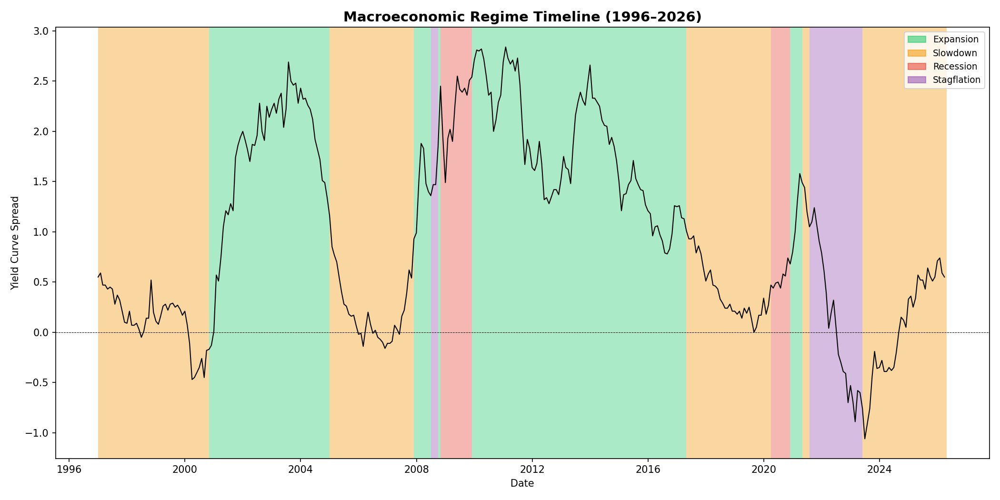
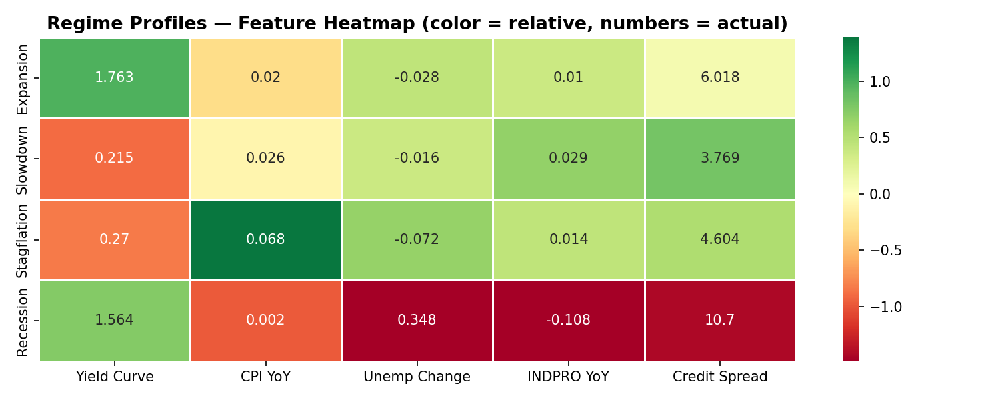
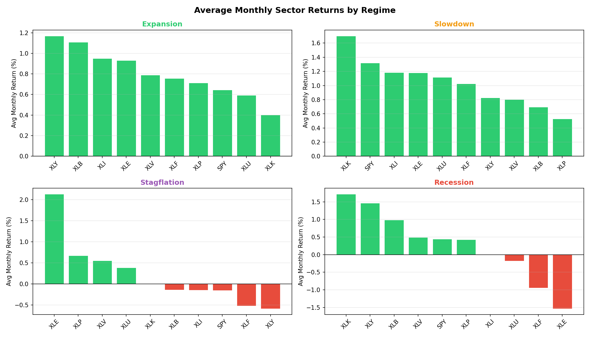

# 📈 Macro Regime Dashboard & Equity Return Predictor

> Macroeconomic regime classification using Gaussian Mixture Models, with sector rotation analysis across expansion, slowdown, stagflation, and recession cycles.

---

## 🔍 Overview

This project builds a data-driven system that classifies the current macroeconomic environment into one of four regimes using real Federal Reserve economic data, then analyzes how equity sectors historically perform in each regime.

The core insight: **markets don't behave the same in all economic environments.** Energy stocks thrive in stagflation. Tech booms in slowdowns. Financials collapse in recessions. This project quantifies those patterns systematically.

**Current Regime (March 2026): Slowdown — 98.8% confidence**

---

## 📊 Outputs

### Regime Timeline (1996–2026)
Color-coded history of every macroeconomic regime across 30 years. Green = Expansion, Orange = Slowdown, Purple = Stagflation, Red = Recession.



---

### Regime Feature Heatmap
Average macro indicator values per regime. Immediately shows what makes each regime distinct — recession has collapsing industrial production and spiking credit spreads; stagflation has the highest inflation by far.



---

### Sector Returns by Regime
Average monthly return for each S&P 500 sector ETF broken down by regime. Energy (XLE) dominates in stagflation. Everything suffers in recession except COVID-distorted tech.



---

## 🧠 Methodology

### Data Sources
| Source | Series | Description |
|--------|--------|-------------|
| FRED API | T10Y2Y | 10Y–2Y Treasury spread (yield curve) |
| FRED API | CPIAUCSL | Consumer Price Index → YoY inflation rate |
| FRED API | UNRATE | Unemployment rate → MoM change |
| FRED API | INDPRO | Industrial Production Index → YoY growth |
| FRED API | BAMLH0A0HYM2 | High Yield credit spread |
| yfinance | SPY + 9 sector ETFs | Monthly equity returns (1998–present) |

### Feature Engineering
Raw FRED series are transformed into economically meaningful signals:
- **CPI** → Year-over-Year % change (inflation rate)
- **INDPRO** → Year-over-Year % change (growth rate)
- **Unemployment** → Month-over-month change (direction matters more than level)
- Yield curve and credit spread used as-is (already spreads)
- All features standardized to mean=0, std=1 before modeling

### Regime Classification
A **Gaussian Mixture Model (GMM)** with full covariance matrices clusters 352 months of macro data into 4 regimes. BIC score analysis confirmed 4 as the optimal number of components. The GMM assigns soft probabilities to each month rather than hard labels, capturing uncertainty at regime transitions.

| Regime | Yield Curve | CPI YoY | INDPRO YoY | Credit Spread |
|--------|------------|---------|------------|---------------|
| Expansion | 1.76 (steep) | 2.0% | +1.0% | 6.02 |
| Slowdown | 0.22 (flat) | 2.6% | +2.9% | 3.77 |
| Stagflation | 0.27 (flat) | 6.8% | +1.4% | 4.60 |
| Recession | 1.56 | 0.2% | **-10.8%** | **10.70** |

---

## 🗂️ Project Structure

```
Macro_Regime/
├── src/
│   ├── data_pipeline.py          # FRED + yfinance data ingestion
│   ├── feature_engineering.py    # YoY transforms, standardization
│   ├── regime_classifier.py      # GMM training, BIC selection, labeling
│   └── visualizations.py         # All charts + live dashboard
├── data/
│   ├── raw/                      # FRED + equity CSVs (gitignored)
│   └── processed/                # Feature matrix + regime labels (gitignored)
├── outputs/
│   └── charts/                   # Saved PNG visualizations
├── .env                          # FRED API key (gitignored)
├── requirements.txt
└── README.md
```

---

## 🚀 Getting Started

**1. Get a free FRED API key**
Register at [fred.stlouisfed.org](https://fred.stlouisfed.org/docs/api/api_key.html) — takes 2 minutes.

**2. Install dependencies**
```bash
pip install fredapi yfinance pandas numpy matplotlib seaborn scikit-learn python-dotenv
```

**3. Set your API key**

Create a `.env` file in the `Macro_Regime/` folder:
```
FRED_API_KEY=your_key_here
```

**4. Run the pipeline in order**
```bash
python src/data_pipeline.py         # Pull raw data
python src/feature_engineering.py   # Transform features
python src/regime_classifier.py     # Train GMM, label regimes
python src/visualizations.py        # Generate all charts + dashboard
```

---

## 📡 Live Dashboard Output

```
=============================================
  MACRO REGIME DASHBOARD
  As of: March 2026
=============================================
  Current Regime: Slowdown
---------------------------------------------
  Regime Probabilities:
  Slowdown      98.8%  ███████████████████
  Expansion      1.2%
  Recession      0.0%
  Stagflation    0.0%
---------------------------------------------
  Current Macro Indicators:
  Yield Curve:    0.550
  CPI YoY:        2.13%
  Unemp Change:   +0.0
  INDPRO YoY:     1.29%
  Credit Spread:  3.08
=============================================
```

---

## 🗺️ Roadmap

This project is designed to grow in phases as ML skills expand:

- ✅ **Phase 1 (Complete):** GMM regime classification + sector rotation analysis
- ⬜ **Phase 2:** Hidden Markov Models for sequential regime modeling + NLP sentiment analysis on FOMC meeting minutes
- ⬜ **Phase 3:** Reinforcement learning portfolio agent that rotates sectors based on regime signals

---

## 🛠️ Tech Stack

`Python` `pandas` `numpy` `scikit-learn` `matplotlib` `seaborn` `fredapi` `yfinance`

---

*Built as part of an ongoing quantitative finance + ML learning project. Phase 2 coming after additional ML coursework.*